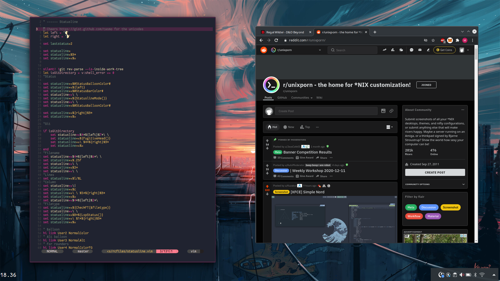

# Dotfiles 🎁

> It didn’t start as a project.
> More like a quiet accumulation. A need to see clearly, to move deliberately, to not depend on what couldn’t be trusted.
> 
> So the system was shaped — over time, across late nights and long stretches of silence. Some tools were written out of necessity. Others were pulled in from elsewhere, selected with care, kept because they earned their place. Nothing ornamental, nothing adopted blindly. The goal was always clarity.
> 
> A soft pink glow settled over it all. Not decorative — just part of the atmosphere. Something gentle in the corner of the eye, a reminder of focus, of presence. Windows opened like breath. Processes shifted without ceremony. No friction. Just momentum.
> 
> It worked, mostly, because it had to. A space to build in, think in, teach from — even if the teaching wasn’t formal. There were people who asked how it was done. When it made sense to share, it was shared. Quietly. Without performance.
> 
> It wasn’t about being followed.
> Just: this is how it was made.
> If it helps, take what you need.
> 
> And then — back to the work.

### Tools

- NeoVim
- Bat
- Fzf
- Alacritty
- Ulauncher
- Picom
- Tmux
- sway
- And a lot more

### Example

